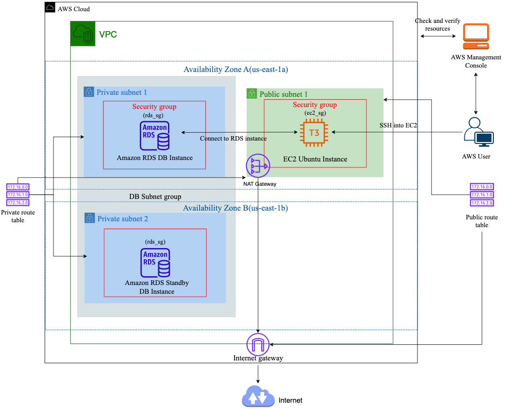

# Terraform Project: VPC with EC2 and RDS Setup



In this Terraform project, I created a robust and secure AWS infrastructure that includes a Virtual Private Cloud (VPC) with both public and private subnets, an EC2 instance for administrative access, and a MySQL RDS instance for database management. Below is a detailed explanation of the infrastructure setup and its components.

## VPC Configuration

1. Virtual Private Cloud (VPC):

- Created a VPC to house all the resources.
- Defined CIDR blocks for efficient IP address management.

2. Subnets:

- Created two public subnets and two private subnets across two availability zones for high availability.
- Defined CIDR blocks for each subnet.

3. Route Tables:

- Created separate route tables for public and private subnets.
- Configured route associations to connect the subnets to the respective route tables.

4. Internet Gateway:

- Attached an internet gateway to the VPC to enable internet access for the public subnets.

## EC2 Instance Setup

1. EC2 Instance:

- Deployed an Ubuntu t3.micro instance within the first public subnet.
- Configured the instance to use an Elastic IP for consistent public access.

2. Security Group for EC2:

- Created a security group to allow SSH access via port 22.
- Restricted the ingress rule to allow SSH access only from specific IP addresses for enhanced security.

3. Key Pair:

- Generated a key pair locally to secure SSH access to the EC2 instance.
- Note: Generating the key pair locally in the root directory is not the most secure practice. It's recommended to use AWS Key Management Service (KMS) or other secure methods to manage your keys.

## RDS MySQL Database Setup

1. RDS Instance:

- Deployed an RDS MySQL instance within the private subnet group to ensure database security.
- Configured the database instance with necessary parameters like allocated storage,
  instance class, and engine version.

2. Security Group for RDS:

- Created a security group to allow access to the RDS instance only via port 3306.
- Restricted access to the RDS instance from specific IP addresses or security groups, typically allowing access only from the EC2 instance.

## Detailed Component Breakdown

1. VPC:

```hcl
   resource "aws_vpc" "rds_vpc" {
   cidr_block = var.vpc_cidr
   enable_dns_hostnames = true
   tags = {
   Name = "rds_vpc"
   }
   }
```

2. Subnets:

```hcl
resource "aws_subnet" "public_subnets" {
for_each = var.public_subnets
vpc_id = aws_vpc.rds_vpc.id
cidr_block = cidrsubnet(var.vpc_cidr, 8, each.value + 100)
availability_zone = tolist(data.aws_availability_zones.available.names)[each.value]
map_public_ip_on_launch = true

tags = {
Name = each.key
Terraform = "true"
}
}


resource "aws_subnet" "private_subnets" {
for_each = var.private_subnets
vpc_id = aws_vpc.rds_vpc.id
cidr_block = cidrsubnet(var.vpc_cidr, 8, each.value)
availability_zone = tolist(data.aws_availability_zones.available.names)[each.value]

tags = {
Name = each.key
Terraform = "true"
}
}
```

3. Route Tables and Associations:

```hcl
resource "aws_route_table" "public_route_table" {
vpc_id = aws_vpc.rds_vpc.id

route {
cidr_block = "0.0.0.0/0"
gateway_id = aws_internet_gateway.internet_gateway.id
#nat_gateway_id = aws_nat_gateway.nat_gateway.id
}
tags = {
Name = "public_rtb"
Terraform = "true"
}
}

resource "aws_route_table" "private_route_table" {
vpc_id = aws_vpc.rds_vpc.id

tags = {
Name = "private_rtb"
Terraform = "true"
}
}

resource "aws_route_table_association" "public" {
depends_on = [aws_subnet.public_subnets]
route_table_id = aws_route_table.public_route_table.id
for_each = aws_subnet.public_subnets
subnet_id = each.value.id
}

resource "aws_route_table_association" "private" {
depends_on = [aws_subnet.private_subnets]
route_table_id = aws_route_table.private_route_table.id
for_each = aws_subnet.private_subnets
subnet_id = each.value.id
}
```

4. Internet Gateway:

```hcl
resource "aws_internet_gateway" "internet_gateway" {
vpc_id = aws_vpc.rds_vpc.id
tags = {
Name = "internet_access_igw"
}
}
```

5. EC2 Instance:

```hcl
data "aws_ami" "ubuntu" {
most_recent = true

filter {
name = "name"
values = ["ubuntu/images/hvm-ssd/ubuntu-jammy-22.04-amd64-server-*"]
}

filter {
name = "virtualization-type"
values = ["hvm"]
}

owners = ["099720109477"] # Canonical
}

resource "aws_instance" "web" {
ami = data.aws_ami.ubuntu.id
instance_type = "t3.micro"
subnet_id = aws_subnet.public_subnets["public_subnet_1"].id
associate_public_ip_address = true
key_name = aws_key_pair.ec2_key_pair.key_name

vpc_security_group_ids = [aws_security_group.ec2_sg.id]
depends_on = [aws_key_pair.ec2_key_pair, aws_security_group.ec2_sg]

tags = {
Name = "For RDS"
}
}
```

6. EC2 Security Group:

```hcl
resource "aws_security_group" "ec2_sg" {
name = "ec2_sg"
description = "Allow SSH inbound traffic"
vpc_id = aws_vpc.rds_vpc.id
depends_on = [aws_vpc.rds_vpc]

ingress {
description = "Allow SSH"
from_port = 22
to_port = 22
protocol = "tcp"
cidr_blocks = ["0.0.0.0/0"]
}

egress {
from_port = 0
to_port = 0
protocol = "-1"
cidr_blocks = ["0.0.0.0/0"]
}

tags = {
Name = "ec2_sg"
}
}
```

7. Key Pair:

### Instructions for generating a key pair locally and storing it securely

```hcl
resource "local_sensitive_file" "tf_key" {
content = tls_private_key.rsa.private_key_pem
file_permission = "600"
directory_permission = "700"
filename = "${aws_key_pair.ec2_key_pair.key_name}.pem"
}

resource "aws_key_pair" "ec2_key_pair" {
key_name = "ec2_key_pair"
public_key = tls_private_key.rsa.public_key_openssh
}

resource "tls_private_key" "rsa" {
algorithm = "RSA"
rsa_bits = 4096
}
```

8. RDS Instance:

```hcl
resource "aws_db_instance" "myrdsinstance" {
engine = "mysql"
identifier = "myrdsinstance"
allocated_storage = 5
engine_version = "8.0"
instance_class = "db.t3.micro"
username = var.username
password = var.password
parameter_group_name = "default.mysql8.0"
vpc_security_group_ids = ["${aws_security_group.rds_sg.id}"]
skip_final_snapshot = true
publicly_accessible = false
db_subnet_group_name = aws_db_subnet_group.rds_subnets.name
}

resource "aws_db_subnet_group" "rds_subnets" {
name = "my-db-subnet-group"
subnet_ids = [aws_subnet.private_subnets["private_subnet_1"].id, aws_subnet.private_subnets["private_subnet_2"].id]
}
```

9. RDS Security Group:

```hcl
resource "aws_security_group" "rds_sg" {
name = "rds_sg"
vpc_id = aws_vpc.rds_vpc.id

ingress {
from_port = 3306
to_port = 3306
protocol = "tcp"
cidr_blocks = ["0.0.0.0/0"]
}
egress {
from_port = 0
to_port = 0
protocol = "-1"
cidr_blocks = ["0.0.0.0/0"]
}
}
```

## Security Considerations

- Ensure that SSH access is restricted to specific IP addresses.
- Use AWS IAM roles and policies for access management.
- Regularly rotate the key pairs and credentials.
- Consider using AWS KMS for secure key management.

# Conclusion

This Terraform project sets up a secure and scalable infrastructure with a VPC, EC2 instance, and RDS MySQL database. The use of public and private subnets, along with appropriate security groups, ensures a well-secured environment for your applications and databases. Make sure to follow best practices for key management and access control to maintain a secure setup.
