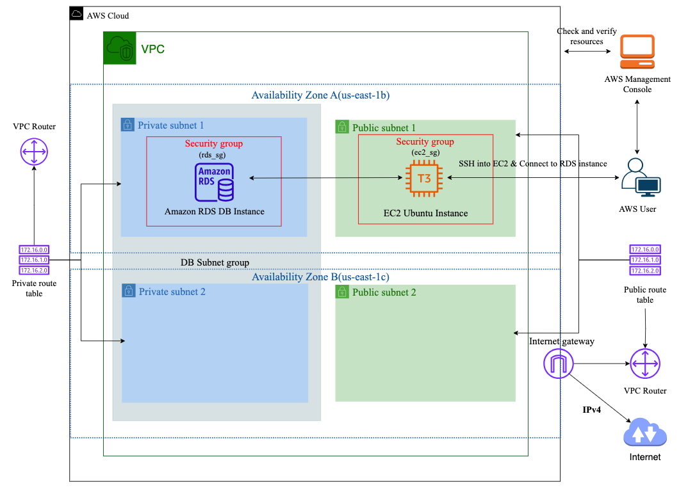

# Provisioning RDS MySQL and EC2 Instance with Terraform and CI/CD

This project creates a secure AWS infrastructure using Terraform and CI/CD practices. It includes a VPC, subnets, an EC2 instance, and an RDS MySQL database. Below is a summary of the setup and its key components.

## Overview

- **VPC**: Hosts all resources with efficient IP address management.
- **Subnets**: Public and private subnets across two availability zones for high availability.
- **EC2 Instance**: For administrative access, deployed in a public subnet.
- **RDS MySQL Database**: Securely hosted in private subnets.

Detailed guides:
- [Infrastructure Setup Documentation](https://medium.com/@ayolowo9/provisioning-mysql-rds-database-and-ec2-instance-using-terraform-4ed8a42f84e9)
- [CI/CD Workflow Documentation](https://medium.com/@ayolowo9/using-github-actions-to-deploy-terraform-configuration-to-aws-a-ci-cd-workflow-fff3b420ee62)

## VPC Configuration

- **Virtual Private Cloud (VPC)**: Centralized network to house all resources.
- **Subnets**: 
  - Public subnets for internet-facing resources.
  - Private subnets for secure, internal resources.
- **Route Tables**: Configured for public and private subnets with proper route associations.
- **Internet Gateway**: Enables internet access for public subnets.

## EC2 Instance Setup

- **Instance**: Ubuntu `t3.micro` deployed in a public subnet with an Elastic IP.
- **Security**:
  - Security group allows SSH access on port 22.
  - Ingress restricted to specific IP addresses for enhanced security.
- **Key Pair**: Secure SSH key pair generated locally (recommendations provided for best practices).

## RDS MySQL Database Setup

- **Instance**: MySQL RDS hosted in private subnets with configurable parameters.
- **Security**:
  - Security group allows access via port 3306.
  - Access restricted to the EC2 instance or specific IPs.

## Security Best Practices

- Restrict SSH access to specific IP addresses.
- Use IAM roles and policies for access control.
- Rotate key pairs and credentials regularly.
- Use AWS KMS or similar services for key management.

## Conclusion

This project demonstrates how to set up a secure and scalable AWS infrastructure using Terraform and CI/CD. It follows best practices for networking, access control, and database management, ensuring a well-protected environment for applications and data.
